## Part 1. Инструмент ipcalc 

 **1.1. Сети и маски**

- 1) Адрес сети 192.167.38.54/13

Адрес сети 192.167.38.54 11000000.10100111.00100110.00110110

Маска подсети /13  11111111.11111000.00000000.00000000 (первые 13 единицы, остальные 0, и это будет 255.248.0.0)

Теперь операция AND между IP-адресом 192.167.38.54 и маской подсети 255.248.0.0:

11000000.10100111.00100110.00110110 

11111111.11111000.00000000.00000000

11000000.10100000.00000000.00000000  (в десятичной 192.160.0.0)
 

  
- 2) Перевод маски **255.255.255.0** в префиксную и двоичную запись: **/24** и **11111111.11111111.11111111.00000000**

   Перевод маски **/15** в обычную и двоичную: **255.254.0.0** и **11111111.11111110.00000000.00000000**
    
   Перевод маски **11111111.11111111.11111111.11110000** в обычную и префиксную: **255.255.255.240** и **/28** 
   

   
- 3) Минимальный и максимальный хост в сети **12.167.38.4** при масках:

 **/8**;
 
 **11111111.11111111.00000000.00000000** (/16);
 
 **255.255.254.0** (/23);
 
**/4**

**1.2. localhost**

- Определить можно ли обратиться к приложению, работающему на localhost, со следующими IP: 

**194.34.23.100**;

**127.0.0.2**;

**127.1.0.1**;

**128.0.0.1**;

К приложениям, работающим на localhost, с IP **127.0.0.2** и **127.1.0.1** обратиться можно, т.к у них есть метка **"loopback"** Эта метка относится к локальному сетевому интерфейсу на компьютере, который обычно идентифицируется IP-адресом 127.0.0.1 (localhost). Этот интерфейс используется для локального обмена данными между приложениями на самом компьютере без необходимости использования физической сети. Это удобно для тестирования и отладки приложений, а также для работы с локальными ресурсами без необходимости использования реальной сети.

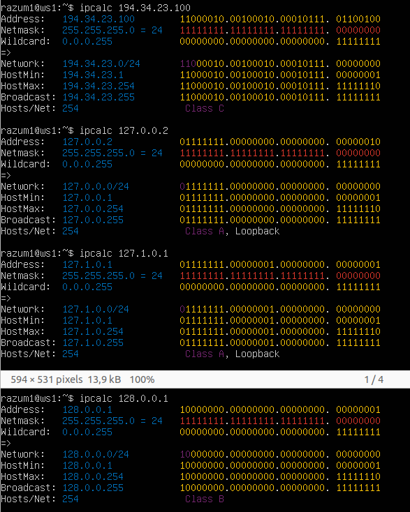

**1.3. Диапазоны и сегменты сетей**
- 1) Определить какие из перечисленных IP можно использовать в качестве публичного, а какие только в качестве частных: 

**10.0.0.45**;

**134.43.0.2**;

**192.168.4.2**;

**172.20.250.4**;

**172.0.2.1**;

**192.172.0.1**;

**172.68.0.2**;

**172.16.255.255**;

**10.10.10.10**;

**192.169.168.1**.

Частные: **192.168.4.2**, **172.0.2.1**, **192.172.0.1**, **172.16.255.255**, **10.10.10.10**.

Публичные: остальные. нет метки **Private Internet**

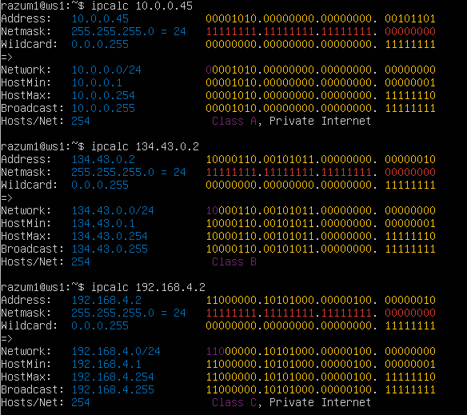
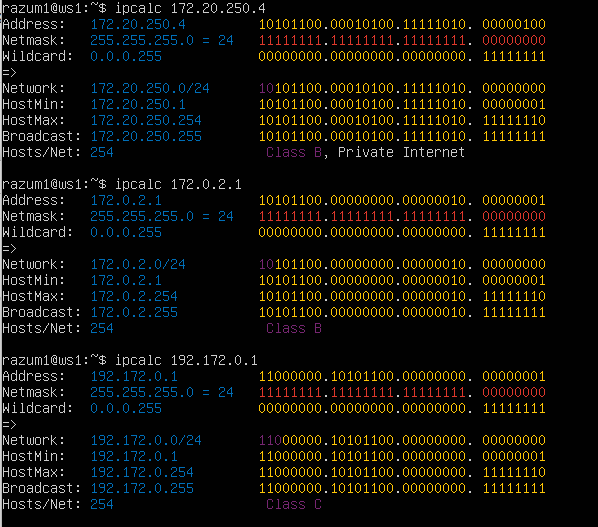

- 2) Определить какие из перечисленных IP адресов шлюза возможны у сети **10.10.0.0/18**: 10.0.0.1, 10.10.0.2, 10.10.10.10, 10.10.100.1, 10.10.1.255

У сети **10.10.0.0/18** возможны следующие  IP адреса шлюзов: 10.10.0.2, 10.10.10.10, 10.10.1.255

## Part 2. Статическая маршрутизация между двумя машинами

- С помощью команды 'ip a' смотрим существующие сетевые интерфейсы. Вывод предоставляет детальную информацию о сетевых интерфейсах машин, их конфигурации (IP-адреса, маски, MAC-адреса), статусе и других параметрах, что помогает понять текущее сетевое состояние машин. 

1) **lo** (Loopback):

lo - имя сетевого интерфейса (Loopback).

**LOOPBACK, UP, LOWER_UP** - статус интерфейса (LOOPBACK - интерфейс типа петли, UP - включен, LOWER_UP - физическое соединение установлено).

**mtu 65536** - максимальный размер передаваемого пакета для этого интерфейса.

**inet 127.0.0.1/8** - IP-адрес интерфейса и его сетевая маска.

2) **enp0s3**:

enp0s3 - имя сетевого интерфейса.

**BROADCAST, MULTICAST, UP, LOWER_UP** - статус интерфейса (UP - включен и работает, BROADCAST - поддержка широковещательной передачи, MULTICAST - поддержка групповой передачи).

**mtu 1500** - максимальный размер передаваемого пакета для этого интерфейса.

**link/ether 08:00:27:2f:b4:41** - MAC-адрес интерфейса.

**inet 10.0.2.15/24** - IP-адрес интерфейса и его сетевая маска.

**brd 10.0.2.255** - широковещательный адрес.

**scope global dynamic** - область видимости адреса (глобальный динамический).

**inet6 fe80::c7b5:18da:c077:407c/64** - IPv6-адрес интерфейса.

**scope link** - область видимости IPv6 адреса (ссылка).

**valid_lft** - срок действия (Lifetime) текущего состояния адреса (сколько времени данный адрес останется в состоянии "валиден" (valid))

- На машинах и задаю следующие адреса и маски: ws1 - 192.168.100.10, маска /16, ws2 - 172.24.116.8, маска /12.

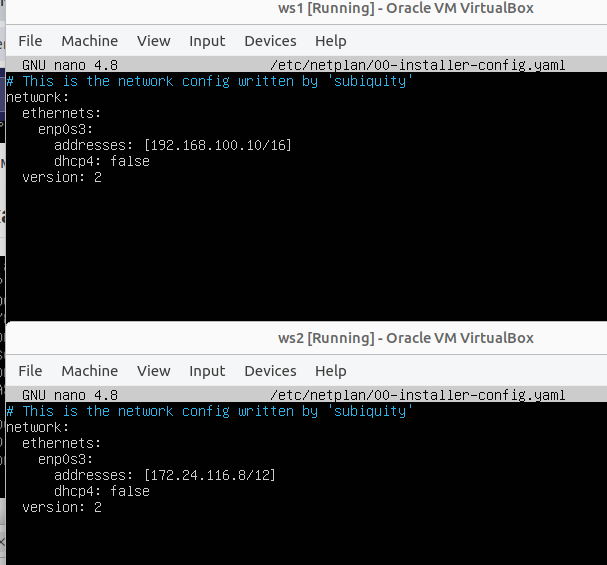

- Выполни команду **netplan apply** для перезапуска сервиса сети. В отчёт помести скрин с вызовом и выводом использованной команды. (специально взяла прям текст из задания. т.к вижу, что скин глупый)

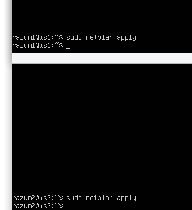

**2.1. Добавление статического маршрута вручную**

задание: Добавь статический маршрут от одной машины до другой и обратно при помощи команды вида ip r add. Пропингуй соединение между машинами.

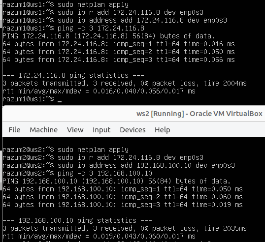

**2.2. Добавление статического маршрута с сохранением**

задание: Добавь статический маршрут от одной машины до другой с помощью файла etc/netplan/00-installer-config.yaml. Пропингуй соединение между машинами.

## Part 3. Утилита iperf3

**3.1. Скорость соединения**

Переведи и запиши в отчёт: 8 Mbps в MB/s, 100 MB/s в Kbps, 1 Gbps в Mbps

Это скорость передачи данных.

(Мегабит в секунду, Mbit/s, Megabit per second, Mb/s, mbps) 1 Мбит/с = 1 000 кбит/с = 1 000 000 бит/с.

8 Mbps = 1 MB/s

(Мегабайт в секунду, Mbyte/s, Megabyte per second, MB/s, MBps) 1 Мбайт/с = 8 000 кбит/с = 8 000 000 бит/с

100 MB/s = 800000 Kbps

(Гигабит в секунду, Gbit/s, Gigabit per second, Gbps) 1 Гигабит/с = 1 000 мбит/с = 1 000 000 000 бит/с

1 Gbps = 1000 Mbps

**3.2. Утилита iperf3**

Измерить скорость соединения между ws1 и ws2.

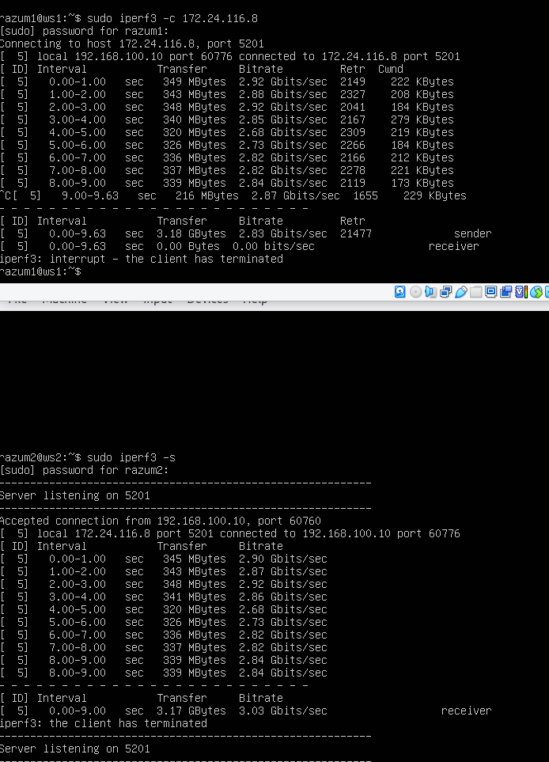

## Part 4. Сетевой экран

**4.1. Утилита iptables**

задание:

Создай файл /etc/firewall.sh, имитирующий фаерволл, на ws1 и ws2:

#!/bin/sh

#Удаление всех правил в таблице «filter» (по-умолчанию).
iptables -F
iptables -X

Нужно добавить в файл подряд следующие правила:

- 1) На ws1 примени стратегию, когда в начале пишется запрещающее правило, а в конце пишется разрешающее правило (это касается пунктов 4 и 5).

- 2) На ws2 примени стратегию, когда в начале пишется разрешающее правило, а в конце пишется запрещающее правило (это касается пунктов 4 и 5).

- 3) Открой на машинах доступ для порта 22 (ssh) и порта 80 (http).

- 4) Запрети echo reply (машина не должна «пинговаться», т.е. должна быть блокировка на OUTPUT).

- 5) Разреши echo reply (машина должна «пинговаться»).

В отчёт помести скрины с содержанием файла /etc/firewall для каждой машины.

Запусти файлы на обеих машинах командами chmod +x /etc/firewall.sh и /etc/firewall.sh.

В отчёт помести скрины с запуском обоих файлов;

В отчёте опиши разницу между стратегиями, применёнными в первом и втором файлах.

файлы /etc/firewall.sh с правилами

запуск /etc/firewall.sh

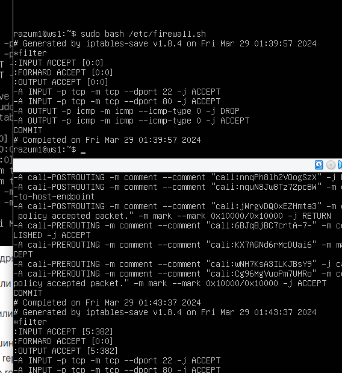

Применяется первое правило, если оно запрещающее, то последующие разрешающие игнорируются (это про echo reply)

**4.2. Утилита nmap**

задание: 

Командой ping найди машину, которая не «пингуется», после чего утилитой nmap покажи, что хост машины запущен.

не пингуется ws1(192.168.100.10)

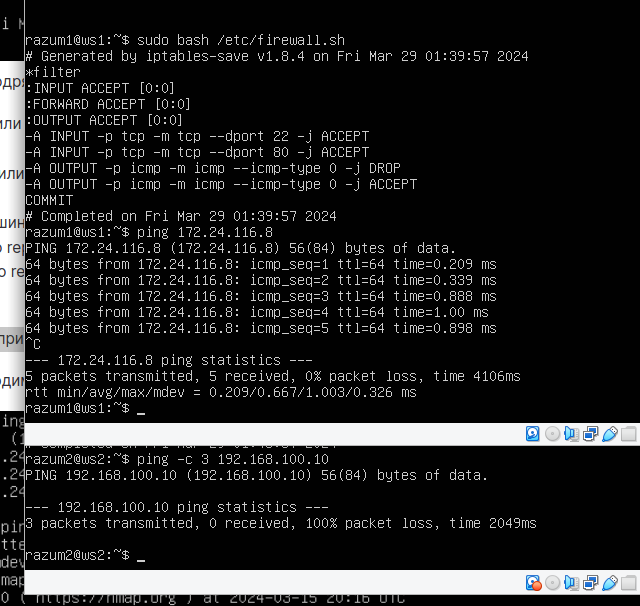

хосты запущены "Host is up" (хоть и не пингуются)

## Part 5. Статическая маршрутизация сети

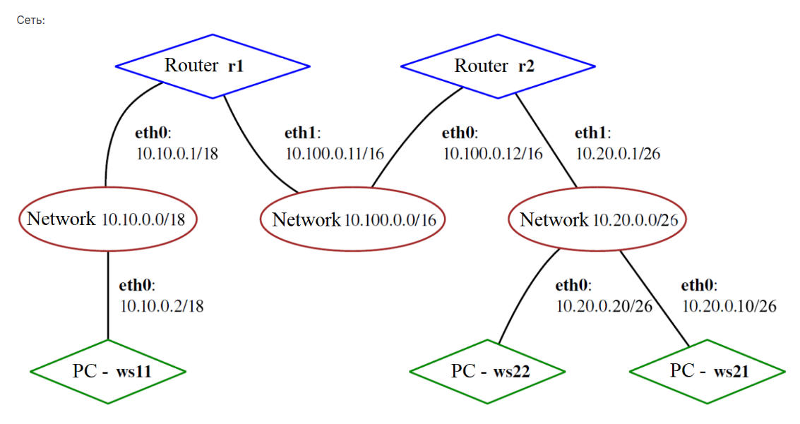

**5.1. Настройка адресов машин**

задание: 

- Настрой конфигурации машин в etc/netplan/00-installer-config.yaml согласно сети на рисунке. В отчёт помести скрины с содержанием файла etc/netplan/00-installer-config.yaml для каждой машины.

- Перезапусти сервис сети. Если ошибок нет, то командой ip -4 a проверь, что адрес машины задан верно

настройка(etc/netplan/00-installer-config.yaml), перезапуск(netplan apply), проверка(ip -4 a) для r1, ws11
 , перезапуск(netplan apply), проверка(ip -4 a) для r1, ws11")

настройка(etc/netplan/00-installer-config.yaml), перезапуск(netplan apply), проверка(ip -4 a) для r2, ws21, ws22

 , перезапуск(netplan apply), проверка(ip -4 a) для r2, ws21, ws22")
 
задание:

пропингуй ws22 с ws21. Аналогично пропингуй r1 с ws11.

**5.2. Включение переадресации IP-адресов**
Для включения переадресации IP, выполнить команду на роутерах: sysctl -w net.ipv4.ip_forward=1
 
При таком подходе переадресация не будет работать после перезагрузки системы.

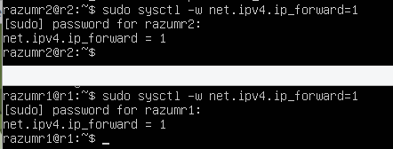

При изменении файла /etc/sysctl.conf  IP-переадресация включена на постоянной основе.

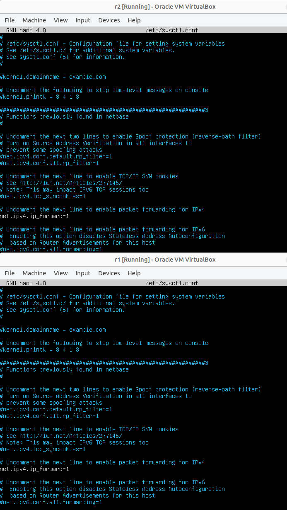

**5.3. Установка маршрута по-умолчанию**

задание:

- Настроить маршрут по-умолчанию (шлюз) для рабочих станций. Для этого добавить default перед IP роутера в файле конфигураций (etc/netplan/00-installer-config.yaml).

- Вызвать ip r и показать, что добавился маршрут в таблицу маршрутизации.

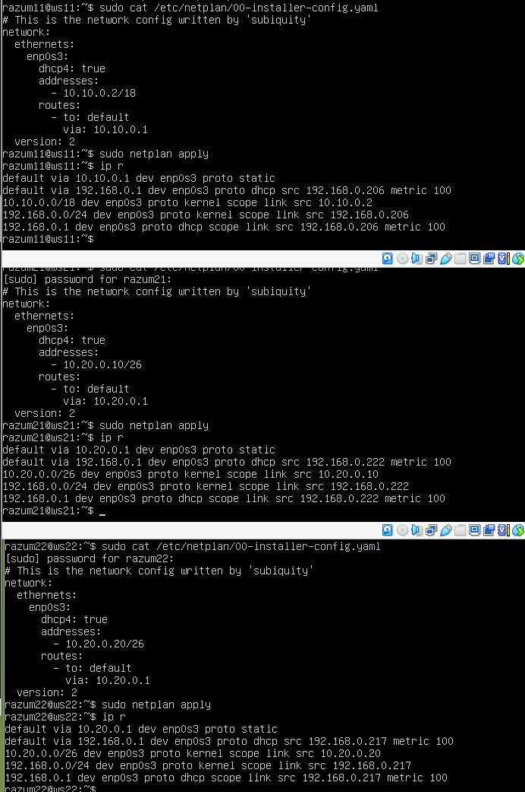

задание:

- Пропинговать с ws11 роутер r2 и показать на r2, что пинг доходит. Для этого использовать команду: tcpdump -tn -i eth0

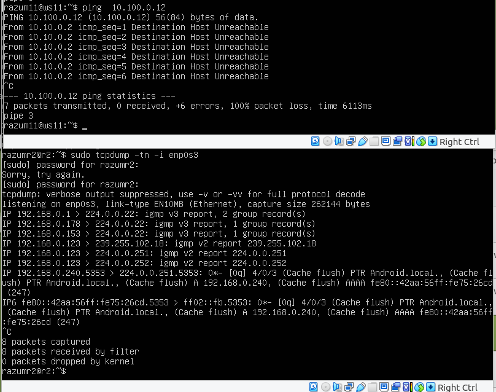

**5.4. Добавление статических маршрутов**

задание:

- Добавь в роутеры r1 и r2 статические маршруты в файле конфигураций.

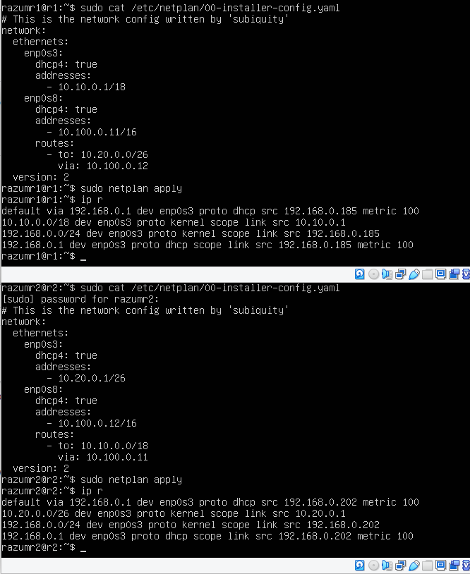

- Запусти команды на ws11:  ip r list 10.10.0.0/[маска сети] и ip r list 0.0.0.0/0

задание:

- Объяснить, почему для адреса 10.10.0.0/[маска сети] был выбран маршрут, отличный от 0.0.0.0/0, хотя он попадает под маршрут по-умолчанию

ответ:

- 10.10.0.0/18 - более конкретный маршрут и он будет иметь более высокий приоритет, чем маршрут по умолчанию 0.0.0.0/0. И он прописан в netplan. 

**5.5. Построение списка маршрутизаторов**

задание:

- Поместить снимок экрана с вызовом и выводом использованных команд (tcpdump и трассировка);
- Объяснить принцип работы пути построения с помощью трассировки

ответ: 

- Traceroute отправляет три датаграммы UDP с TTL, равным единице, в диапазон портов от 33434 до 33534.
Маршрутизатор, получивший датаграмму UDP, устанавливает поле TTL в ноль и отправляет ICMP-сообщение «время превышено».
in-transit» в ответ трассировка получает такое сообщение и отправляет дейтаграмму UDP с TTL.
равен двум. С каждым полученным сообщением ICMP трассировка увеличивает TTL на единицу.
Когда дейтаграмма UDP прибудет на отслеживаемый хост, он ответит сообщением ICMP.
«PORT_UNREACHABLE», что означает, что трассировка завершена.

**5.6. Использование протокола ICMP при маршрутизации**

задание:

- Запустить на r1 перехват сетевого трафика, проходящего через eth0 с помощью команды: tcpdump -n -i eth0 icmp;
- Пропинговать с ws11 увеличивающий IP (например, 10.30.0.111 ) с помощью команды: ping -c 1 10.30.0.111

## Part 6. Динамическая настройка IP с помощью DHCP

задание:

- Для r2 настроить в файле /etc/dhcp/dhcpd.conf конфигурацию службы DHCP и В файле resolv.conf прописать nameserver 8.8.8.8

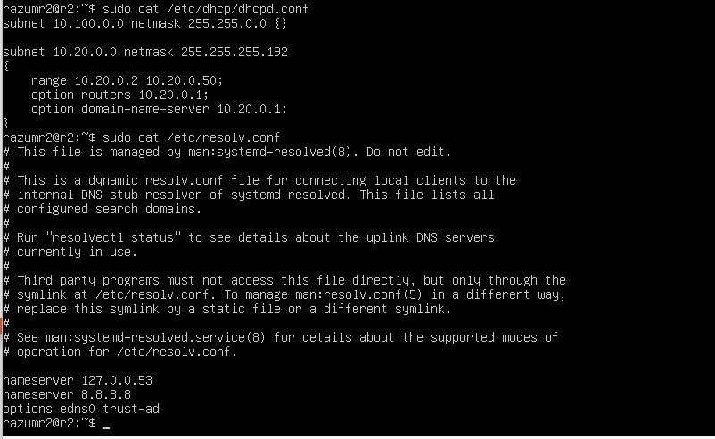

- Указать MAC адрес у ws11, для этого в etc/netplan/00-installer-config.yaml надо добавить строки: macaddress: 10:10:10:10:10:BA, dhcp4: true.

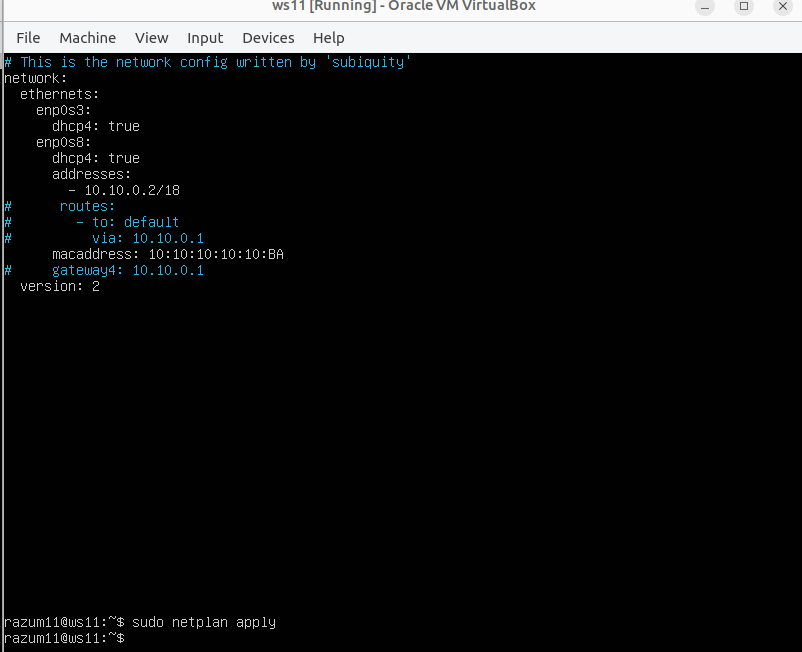

- Для r1 настроить аналогично r2, но сделать выдачу адресов с жесткой привязкой к MAC-адресу (ws11). Провести аналогичные тесты

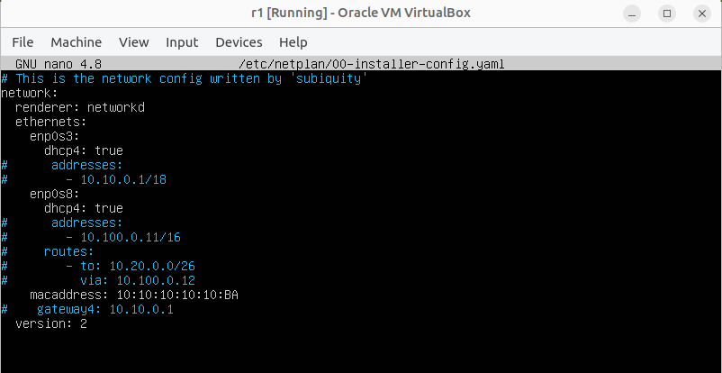

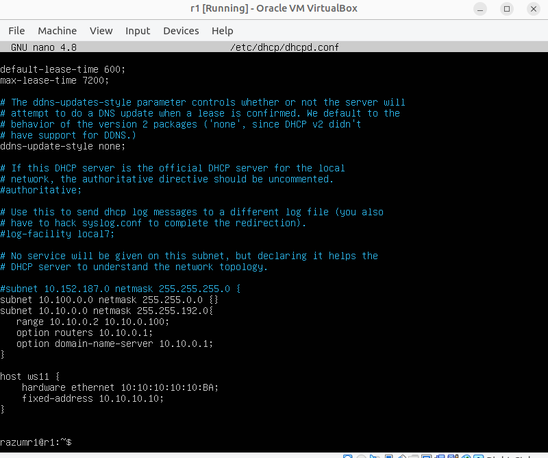

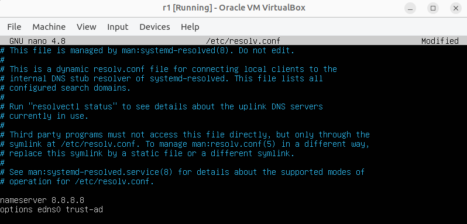

sudo dhclient -r - эта команда освобождает текущий IP-адрес
sudo dhclient    - эта команда запрашивает новый IP-адрес у DHCP-сервера

## Часть 7. NAT

задание :

- В файле /etc/apache2/ports.conf на ws22 и r1 изменить строку Listen 80 на Listen 0.0.0.0:80
- Запустить веб-сервер Apache командой service apache2 start на ws22 и r1.

задание: 

Добавить в фаервол, созданный по аналогии с фаерволом из Части 4, на r2 следующие правила:

1) Удаление правил в таблице filter - iptables -F;

2) Удаление правил в таблице "NAT" - iptables -F -t nat;

3) Отбрасывать все маршрутизируемые пакеты - iptables --policy FORWARD DROP.

Запустить файл также, как в Части 4.

Проверить соединение между ws22 и r1 командой ping.

**При запуске файла с этими правилами, ws22 не должна «пинговаться» с r1.**

В отчёт поместить скрины с вызовом и выводом использованной команды

 **на самом деле правила не писала, просто пропинговала и рез подходящий)**

задание:

Добавить в файл ещё одно правило:

4) Разрешить маршрутизацию всех пакетов протокола ICMP.

Запустить файл также, как в Части 4.

Проверить соединение между ws22 и r1 командой ping.

**При запуске файла с этими правилами, ws22 должна «пинговаться» с r1**

В отчёт поместить скрины с вызовом и выводом использованной команды.

 **еще фотки нет,**

