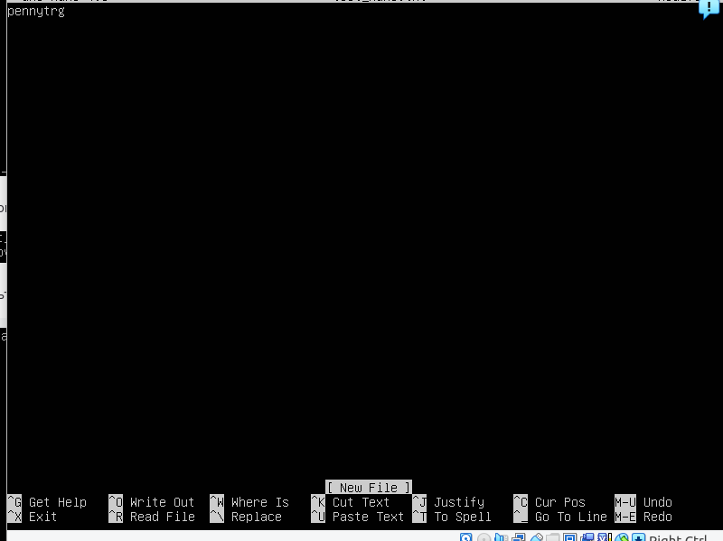

## Part 1. Установка ОС 

- Версия Ubuntu, команда cat /etc/issue:
  

## Part 2. Создание пользователя

- Создание пользователя, команда 
  
  
- Вывод команды  `cat /etc/passwd` (посмотреть пользователя ivanov группа adm):
  
  
## Part 3. Настройка сети ОС
 
- Установила временную зону и название машины вида user-1:
  
  
 - Вывела названия сетевых интерфейсов:
  
  
 - Интерфейс loopback (lo) представляет собой виртуальный сетевой интерфейс на компьютере, который используется для взаимодействия приложений на самом компьютере с сетевым стеком операционной системы.
 
Для чего нужен:
   - Тестирование и диагностика: Интерфейс loopback позволяет компьютеру отправлять и получать трафик, симулируя сетевую активность. Он используется для тестирования сетевой функциональности без фактического подключения к другим устройствам в сети.
   - Локальные соединения: Некоторые приложения могут использовать интерфейс lo для коммуникации между разными компонентами на одном компьютере без использования реальной сети.
Обход физической сети: Иногда интерфейс lo используется для обхода сложностей настройки реальных сетевых интерфейсов при развертывании сетевых сервисов или приложений, где подключение к физической сети не требуется.
    - Интерфейс loopback (lo) обычно имеет IP-адрес 127.0.0.1 и маску подсети 255.0.0.0, что указывает на то, что он находится в локальной петле (loopback) компьютера. Данный интерфейс играет важную роль в обеспечении нормальной работы сетевой среды на компьютере
    
- Получила ip адрес устройства, на котором я работаю, от DHCP сервера (inet 127.0.0.1):
  
  
- Dynamic Host Configuration Protocol (DHCP) – это сетевой протокол, используемый для автоматической настройки устройств в компьютерной сети. DHCP позволяет устройствам (как компьютерам, смартфонам, принтерам и другим сетевым устройствам) получать IP-адрес, подсеть, шлюз по умолчанию и другие сетевые параметры автоматически от DHCP-сервера в сети.
Когда устройство подключается к сети, оно отправляет запрос на получение сетевых параметров DHCP-серверу. DHCP-сервер выделяет доступные параметры для этого устройства на основе доступных адресов в сети и конфигурации DHCP-сервера.
DHCP снижает необходимость вручную настраивать сетевые параметры на каждом устройстве в сети, что делает процесс управления сетью более удобным и эффективным.

- Получила внешний ip-адрес шлюза (ip) (213.148.177.178):
  
  
- Получила внутренний ip-адрес шлюза (ip) (10.0.2.2):
  
  
- Задала статичные настройки ip, gw, dns :
  
  
- Перезагрузила вм, все сохранилось :
  
  
- Успешно пропинговала удаленные хосты 1.1.1.1 и ya.ru (В выводе команды должна быть фраза «0% packet loss»)
    
  
## Part 4. Обновление ОС
- Обновила системные пакеты до последней(команда sudo apt upgrade), на момент выполнения задания, версии (в выводе видно, что обновления отсутствуют)
 
  
## Part 5. Использование команды sudo

- sudo расшифровывается как "Super User Do" или "Substitute User Do". Он позволяет пользователям получить временное повышение привилегий для выполнения команд с правами суперпользователя (root). При использовании sudo, пользователь должен предоставить свой пароль для проверки подлинности перед выполнением привилегированных команд.

- Поменяла hostname ОС на "newhostname" от имени пользователя "ivanov", созданного в пункте 2.
Для этого выполнила шаги: 
1. Добавила ivanov в группу sudo, что бы он мог менять hostname (команда sudo usermod -a -G sudo ivanov)
2. Пименив команду su - ivanov (чтобы не перезаходить под его логином) поменяла hostname на newhostname (команда sudo hostnamectl set-hostname newhostname)
 
 
## Part 6. Установка и настройка службы времени

- Для синхронизации установила chrony (команда sudo apt install chrony)

Проверила текущее состояние синхронизации времени (команда timedatectl status вижу на выводе NTP service: activ)

Проверяю, что NTPSynchronized=yes 

 
## Part 7. Установка и использование текстовых редакторов

- Чтобы создать файл в редакторе Vim, надо выполнить следующие шаги:

Ввести vim название_файла, Enter. vim test_vim.txt.

Нажать i для входа в режим вставки (Insert mode), с помощью которого можно вводить текст.

Напишите необходимый текст(pennytrg) и нажать  Esc, чтобы выйти из режима вставки.

Ввести двоеточие : и  команду wq (write and quit) для сохранения файла и выхода из Vim или q! для выхода без сохранения.

Для поиска и замены слова команда

Результат

 
 
- nano 

для выхода c сохранением  С^X  Y  для выхода без сохранения  С^X  n

здесь буду менять School на Ira

для поиска и замены слова в файле, команда та же, что и была для vim sed -i 's/School/Ira/g' file.txt

-установка micro 

создание файла, ввод текста , выход с сохранением

для выхода c сохранением  С^Q  Y  для выхода без сохранения  С^Q  n

для поиска и замены слова в файле, команда та же, что и была для vim  и nano sed -i 's/School/Ira/g' file.txt

на всякий случай, список имеющихся файлов

## Part 8. Установка и базовая настройка сервиса SSHD

-Установка службы SSHd (если не установлена): 

sudo apt-get update
sudo apt-get install openssh-server

-Добавление автозапуска службы при загрузке системы:

sudo systemctl enable ssh

-перенастройка службы SSHd на порт 2022: 

открыть файл sudo nano /etc/ssh/sshd_config

и отредактировать его (указать Port 2022):

Сохранила изменения и перезапустила службу SSHd:

sudo systemctl restart ssh

-Проверяю наличие процесса sshd:  ps -aux | grep sshd

aux показывает список всех процессов в системе

| grep sshd фильтрует вывод по ключевому слову `sshd`
    

-Проверяю наличие tcp протокола (команда netstat -tan)
 - **tcp**- это протокол TCP (Transmission Control Protocol)
 - **0**: Номер протокола (например, IP, ICMP, TCP, UDP)
 - **0**: Локальный адрес (IP и порт) на котором приложение слушает (0.0.0.0:2022 означает, что приложение слушает все интерфейсы на порту 2022)
 - **0.0.0.0**: Внешний адрес (IP и порт), к которому приложение привязано (например, 0.0.0.0:* означает, что приложение привязано ко всем IP-адресам на порту *)
 - **LISTEN**: Состояние сокета, в данном случае слушающий (ожидающий подключений)
 

## Part 9. Установка и использование утилит top, htop

- Установила утилиты top и htop

- Запустила top

- uptime 19.49 min
- количество авторизованных пользователей 1
- общую загрузку системы 0.00, 0.00, 0.00
- общее количество процессов 113
- загрузку cpu 0.1 us, 0.0 sy, 0.0 ni, 99.9 id, 0.0 wa, 0.0 hi, 0.0 si, 0.0 st
- загрузку памяти 3020.1 total, 176.0 used
- pid процесса занимающего больше всего памяти (MEM) 1
- pid процесса, занимающего больше всего процессорного времени (CPU) 5978

- Отсортировано по PID

- Отсортировано по PERCENT_CPU

- Отсортировано по PERCENT_MEM

- Отсортировано по TIME

- Отфильтрованo для процесса sshd

-  C процессом syslog

-  C добавлением в выводе hostname, clock и uptime

## Part 10. Использование утилиты fdisk

- Команда fdisk -l

- название жесткого диска sda2
- размер жесткого диска 60g
- количество секторов 125822976
- размер swap 3g

## Part 11. Использование утилиты df

df -Th

для корневого раздела (/)
- размер раздела: 59G
- размер занятого пространства 6.2G
- размер свободного пространства 50G
- процент использования 12%

- Тип файловой системы раздела ext4

df -l

для корневого раздела (/)
- размер раздела: 61608748 1k-bloks
- размер занятого пространства 6490604
- размер свободного пространства 51956188
- процент использования 12%

## Part 12. Использование утилиты du
- Команда du -sb path

- Команда du -sb /var/log/* 

## Part 13. Установка и использование утилиты ncdu

- Команда ncdu /home

- Команда ncdu /var

- Команда ncdu /var/log

## Part 14. Работа с системными журналами

- Команда less /var/log/dmesg

- Команда less /var/log/syslog

- Команда less /var/log/auth.log

- Команда last -i 

- Время авторизации Mart 19 15:36
- Имя пользователя ivanov
- Способ подключения logged in

- перезапуск SSHd команда sudo systemctl restart sshd 
- сообщение о рестарте службы команда journalctl -u sshd.service

## Part 15. Использование планировщика заданий CRON

- Запуск uptime через каждые 2 минуты. команда crontab -e и редактирование файла 
 

- Вывод на экран списка текущих заданий для CRON, команда crontab -l

- Вывод лога, команда tail /var/log/syslog, обновление каждые 2 минуты

- Удалила все задания из планировщика заданий, команда crontab -r

- Вывод на экран списка текущих заданий для CRON, команда crontab -l, задания отсутствуют

