# Simple Docker  
  
## Содержание  
  
1. [Часть 1. Готовый докер](#часть-1-готовый-докер)  
2. [Часть 2. Операции с контейнером](#часть-2-операции-с-контейнером)   
  
## Часть 1. Готовый докер  
   * Возьми официальный докер-образ с **nginx** и выкачай его при помощи `docker pull`  
     - 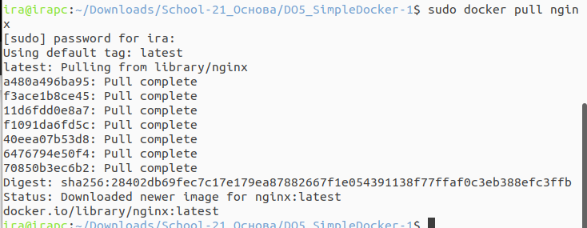    
     - `docker pull nginx`   
   * Проверь наличие докер-образа через `docker images`  
     - 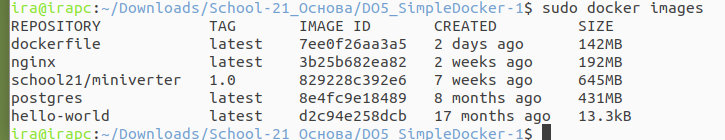  
     - `docker images`   
   * Запусти докер-образ через `docker run -d [image_id|repository]`  
     - 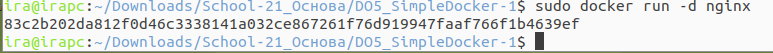  
     - `docker run -d nginx`   
   * Проверь, что образ запустился через `docker ps`  
     - 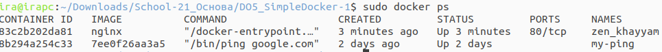  
     - `docker ps`   
   * Посмотри информацию о контейнере через `docker inspect [container_id|container_name]`  
     - 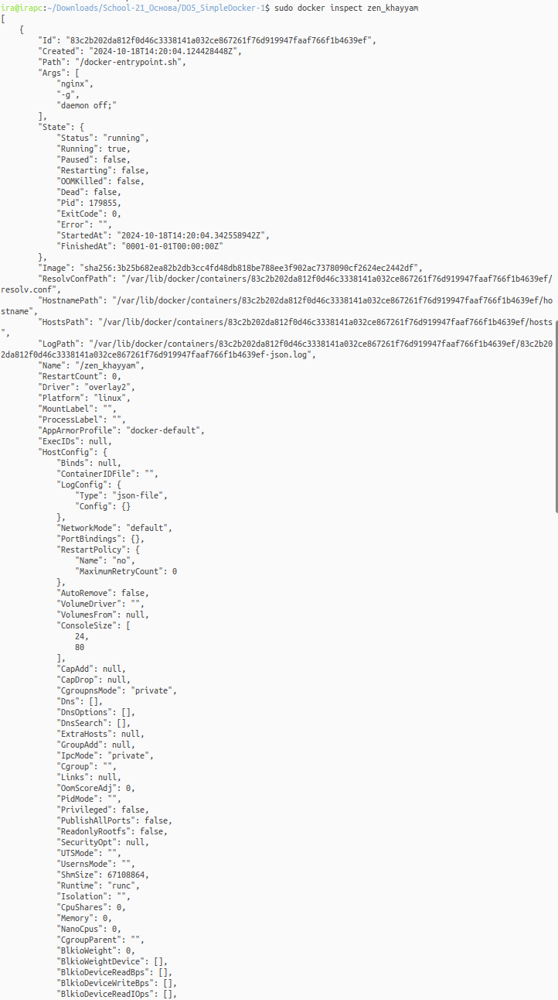  
     - 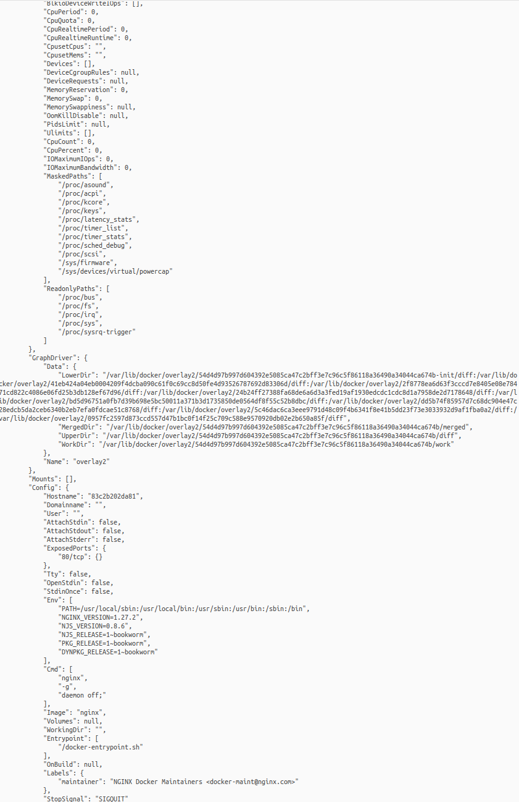  
     - `docker inspect zen_khayyam`(по имени информации больше).   
     - 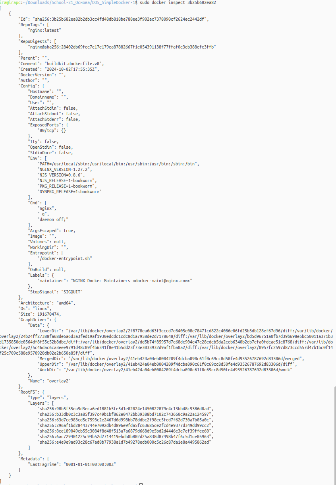  
     - `docker inspect 3b25b682ea82`. 
   * По выводу команды определи и помести в отчёт размер контейнера, список замапленных портов и ip контейнера  
     - 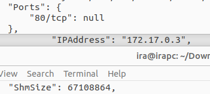  
   * Останови докер образ через `docker stop [container_id|container_name]`    
   * Проверь, что образ остановился через `docker ps`.  
     - 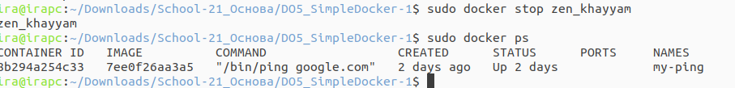
     - `docker stop zen_khayyam`
     - `docker ps`    
   * Запусти докер с портами 80 и 443 в контейнере, замапленными на такие же порты на локальной машине, через команду  
     - 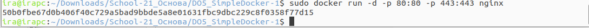  
     - `docker run -d -p 80:80 -p 443:443 nginx`  
   * Проверь, что в браузере по адресу *localhost:80* доступна стартовая страница **nginx**.  
     - 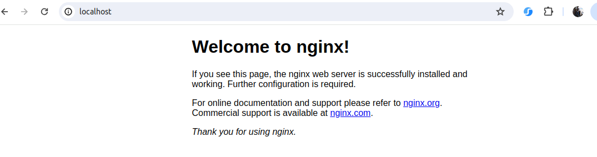  
   * Перезапусти докер контейнер через `docker restart [container_id|container_name]`  
     - 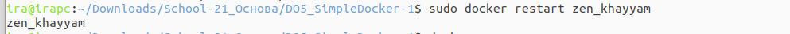  
     - `docker restart a873a7bf2752`  
   * Проверь любым способом, что контейнер запустился.  
     - 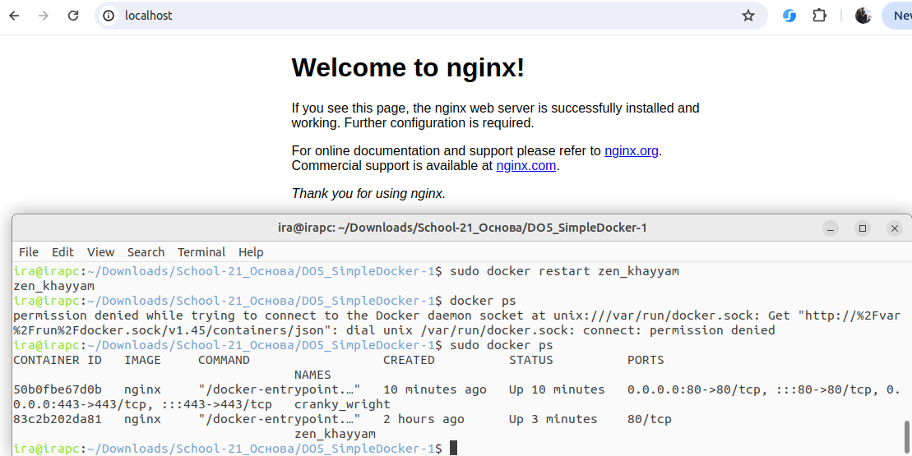  
     
## Часть 2. Операции с контейнером  
   * Прочитай конфигурационный файл *nginx.conf* внутри докер контейнера через команду *exec*  
     - 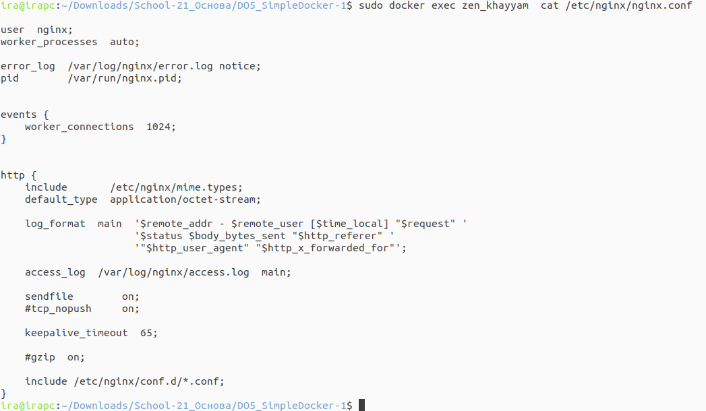  
     - `docker exec zen_khayyam cat /etc/nginx/nginx.conf`  
   * Создай на локальной машине файл *nginx.conf*.
     - 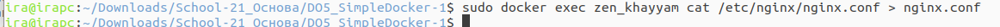  
     - `docker exec zen_khayyam cat /etc/nginx/nginx.conf > nginx.conf`  
   * Настрой в нем по пути */status* отдачу страницы статуса сервера **nginx**  
     - 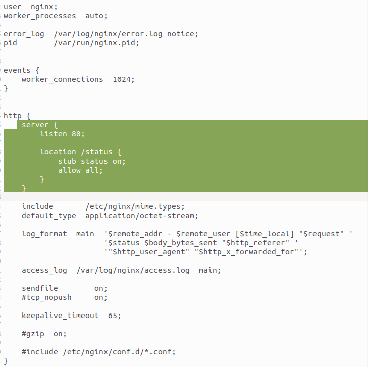  
   * Скопируй созданный файл *nginx.conf* внутрь докер-образа через команду `docker cp`  
     - 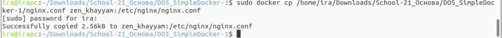  
     - `docker cp /home/ira/Downloads/School-21_Основа/DO5_SimpleDocker-1/nginx.conf zen_khayyam:/etc/nginx/nginx.conf`  
   * Перезапусти **nginx** внутри докер-образа через команду *exec*  
     - 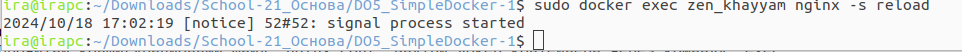  
     - `docker exec zen_khayyam nginx -s reload`  
   * Проверь, что по адресу *localhost:80/status* отдается страничка со статусом сервера **nginx**  
     - 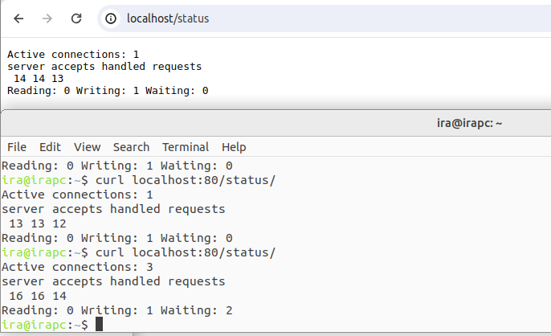  
     - `curl localhost:80/status`  
   * Экспортируй контейнер в файл *container.tar* через команду *export*  
     - 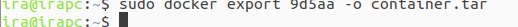  
     - `docker export 9d5aa -o container.tar`  
   * Останови контейнер  
     - 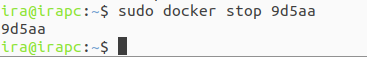  
     - `docker stop 9d5aa`  
   * Удали образ через `docker rmi [image_id|repository]`, не удаляя перед этим контейнеры  
     - 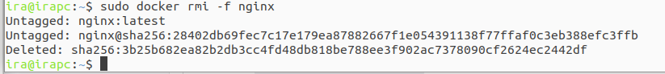  
     - `docker rmi -f nginx`  
   * Удали остановленный контейнер  
     - 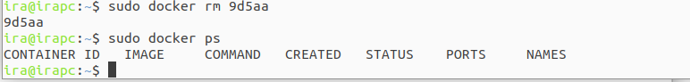   
     - `docker rm 9d5aa`  
     - `docker ps -a`  
   * Импортируй контейнер обратно через команду *import*  
     - 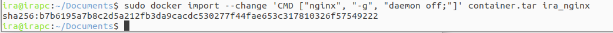  
     - `docker import --change 'CMD ["nginx", "-g", "daemon off;"]' container.tar ira_nginx`  
   * Запусти импортированный контейнер  
     - 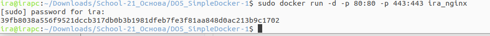  
     - `docker run -d -p 80:80 -p 443:443 ira_nginx`  
   * Проверь, что по адресу *localhost:80/status* отдается страничка со статусом сервера **nginx**  
     - 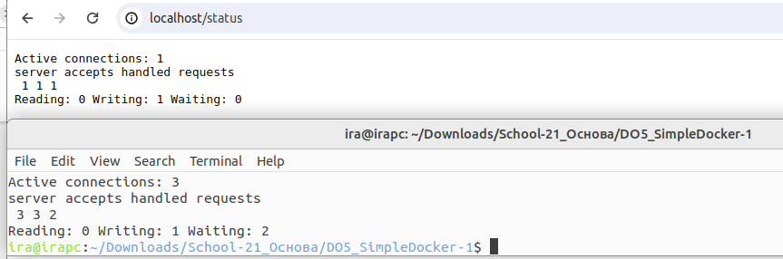  
     - `curl localhost:80/status`
